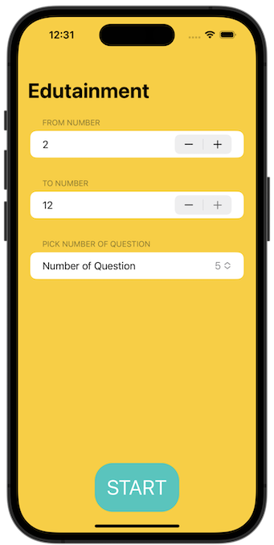
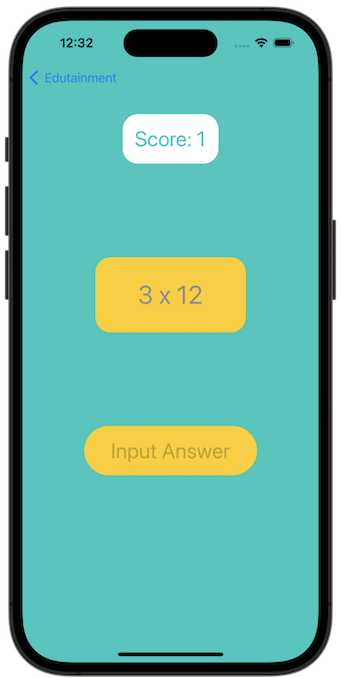
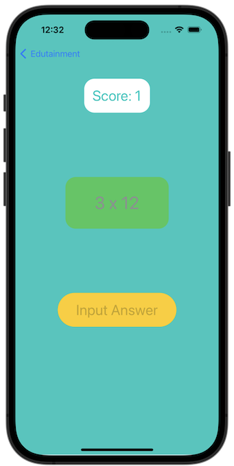
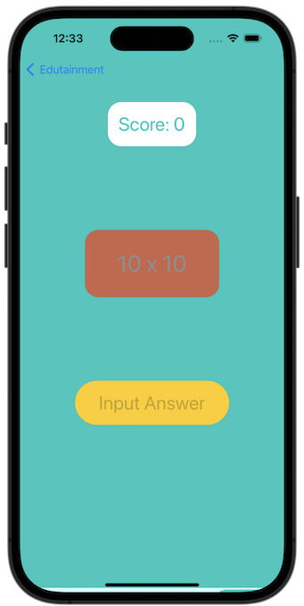

# Milestone Projects 4-6 - Multiplication Tables

https://www.hackingwithswift.com/100/swiftui/35

## Challenge

From [Hacking with Swift](https://www.hackingwithswift.com/guide/ios-swiftui/3/3/challenge):

> Your goal is to build an “edutainment” app for kids to help them practice multiplication tables – “what is 7 x 8?” and so on. Edutainment apps are educational at their code, but ideally have enough playfulness about them to make kids want to play.
>
> Breaking it down:
>
> - The player needs to select which multiplication tables they want to practice. This could be pressing buttons, or it could be an “Up to…” stepper, going from 2 to 12.
> - The player should be able to select how many questions they want to be asked: 5, 10, or 20.
> - You should randomly generate as many questions as they asked for, within the difficulty range they asked for.
>
> If you want to go fully down the “education” route then this is going to be some steppers, a text field and a couple of buttons. I would suggest that’s a good place to start, just to make sure you have the basics covered.
>
> Once you have that, it’s down to you how far you want to take the app down the “entertainment” route – you could throw away fixed controls like Stepper entirely if you wanted, and instead rely on colorful buttons to get the same result.
>
> At the very least, you should:
>
> 1.  Start with an App template, then add some state to determine whether the game is active or whether you’re asking for settings.
> 2.  Generate a range of questions based on the user’s settings.
> 3.  Show the player how many questions they got correct at the end of the game, then offer to let them play again.

## Screenshots

